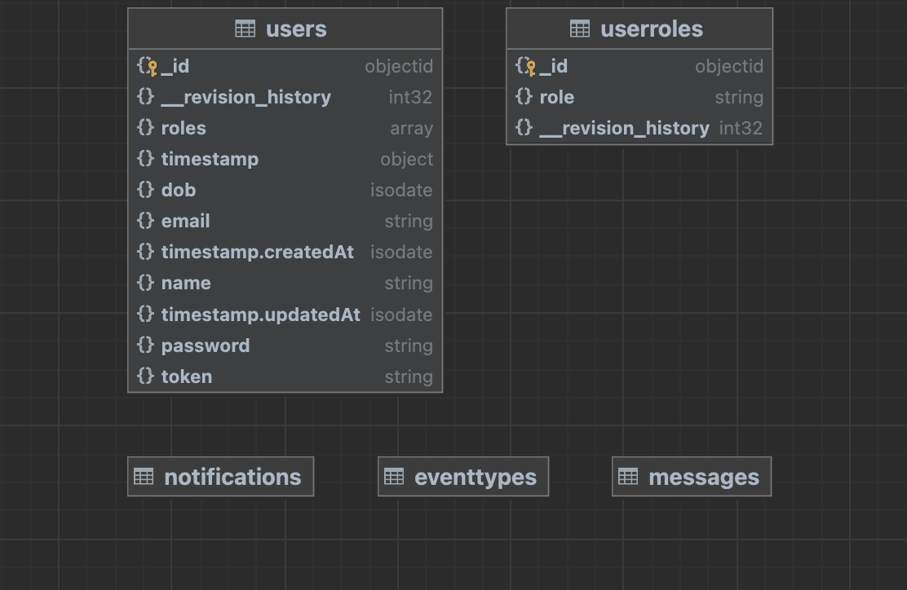
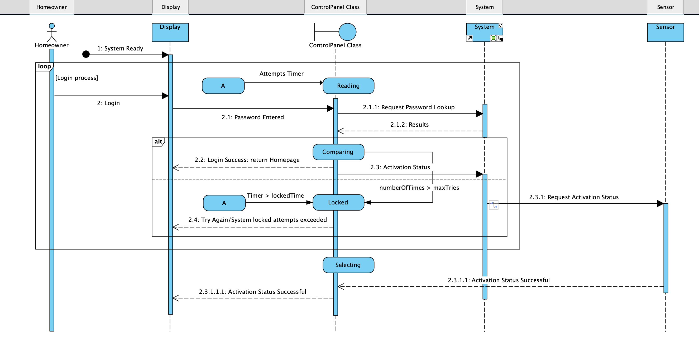
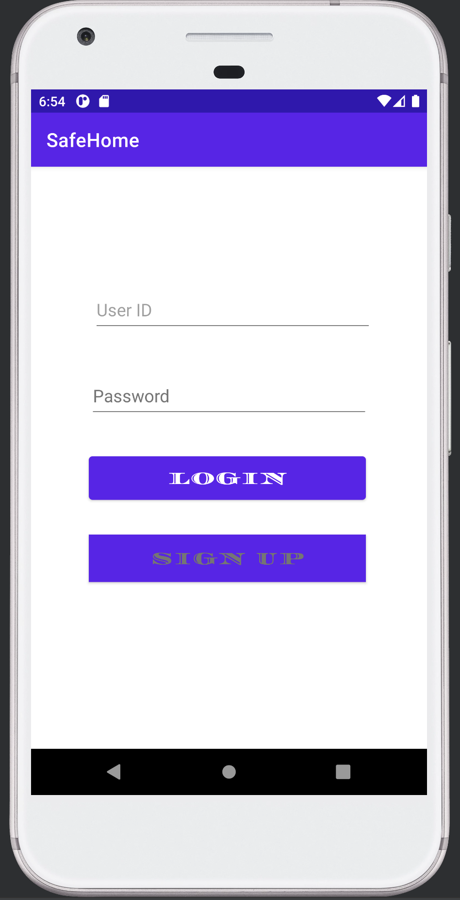
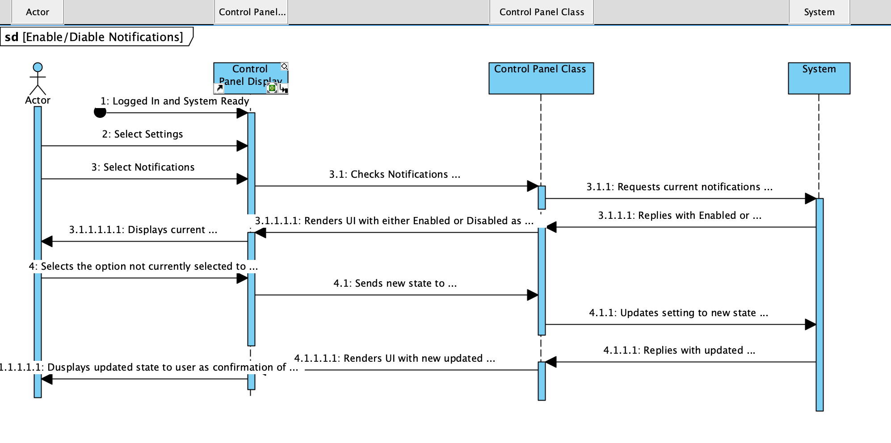

# SafeHome Security System

The `SafeHome App` mobile extends the functionality of the `SafeHome Control Panel` in home unit. 
When the in home unit receives an alert, the `Control Panel` will send an api post request. The request 
is captured and logged to the backend database `Mongodb` and sends a update to the mobile app, which will 
generate a `toast` message.

Users of the mobile app can `register` for an account via mobile app as well as `login` to view notification, 
update notification preferences and view alerts.

The design of the mobile application is loosely coupled.  Enabling features can now be easily added via 
api paths and build separately for the frontend mobile app without any disruption of services.

## [SafeHome API Backend](https://github.com/dellius-alexander/SafeHomeAPI.git)
`SafeHome API Backend` was created in a separate project and code base.  We used `Nodejs, Expressjs and Mongodb` 
for the api backend.  [View API Documentations Here](https://github.com/dellius-alexander/SafeHomeAPI.git)

## Mongo Database

The `Mongodb` backend managed by the api service consists of a few entities used to persist events that occur 
at the users home.

## Login Process

Below shows the sequence diagram for the login process. The user can login or register for a new mobile account 
if this is the first time using the mobile app.

### Login Sequence Diagram

### Login Screen

## Enable/Disable Notifications

This feature allows the user to enable or disable notification alerts.  For example, if the door sensor is 
tripped an alert will be sent to the api and updated in the database for the user alert messages. The api 
service then sends a notification message to the mobile app to alert the user of the event.

## Class Diagram of System Architecture

Below is a UML diagram of the system architecture.

